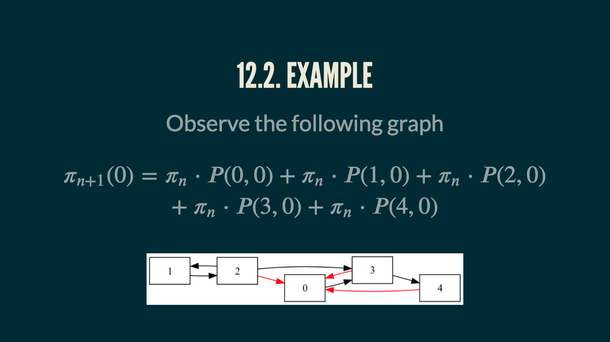
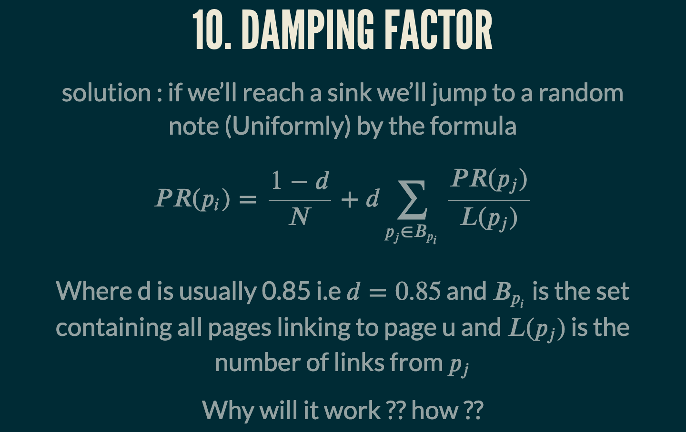

# PageRanking Algorithm 

This git repo contain some cool animation and a 15 minutes 
presentation about the Pageranking algo 

I've also attached some paper written by google founders Sergey Brin and Larry Page 




## How to view ? 
The presentation has been written with the revealjs framework 

``` sh
git clone https://github.com/barakdiker123/PageRanking
open presentation.html
firefox presentation.html
```


## Description 
* Page Rank
* Markov chains 

## References
* [Nice article](https://math.uchicago.edu/~may/VIGRE/VIGRE2007/REUPapers/FINALFULL/Casarotto.pdf)
* [Some inspiring presentation](https://www2.math.upenn.edu/~kazdan/312F12/JJ/MarkovChains/markov_google.pdf)
* [Relation Between Chess scoring and Google pageranking ](https://arxiv.org/pdf/2210.17300.pdf)
This paper was aactually published by Edmund Landau at 1895 
